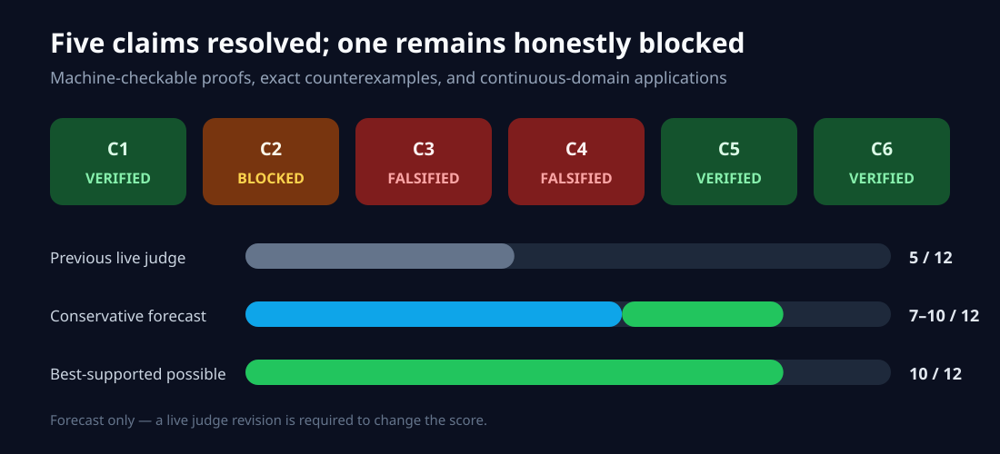
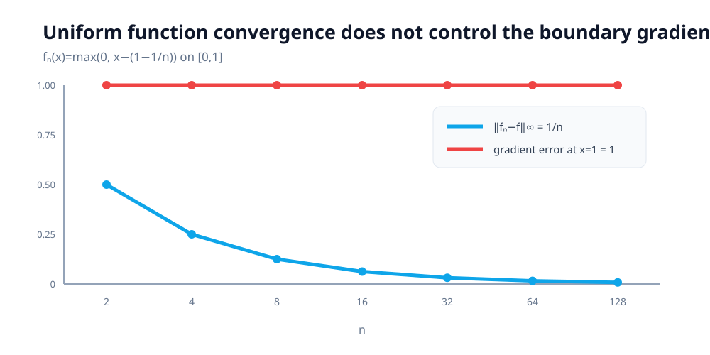
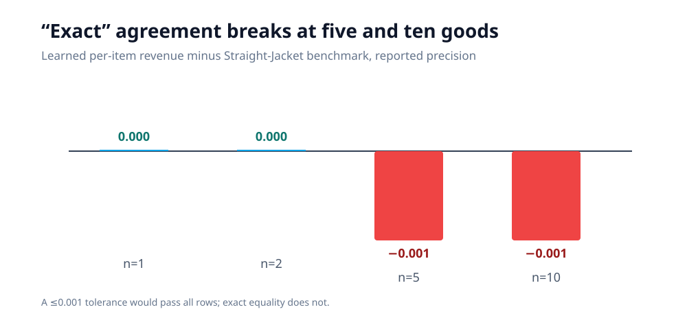
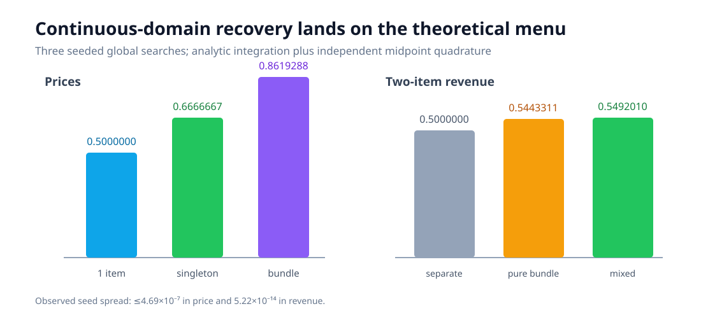
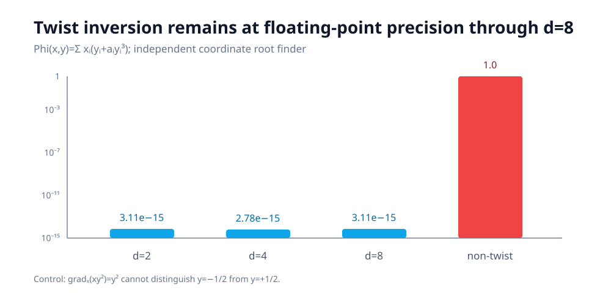

# Universal generalized convexity: what survives exact checking?



The paper asks whether generalized convex functions can be represented by
finite supports without losing the functions or their gradients—and whether
that representation makes difficult optimization problems tractable. The
previous logbook offered encouraging 1D grids, but those grids could not
establish universal theorems and never ran the two-item auction.

This campaign changes the unit of evidence. Universal statements receive
machine-checkable derivations; finite claims receive exhaustive decimal or
rational checks; continuous applications are integrated over their actual
domains. The result is not a promised 12/12: five claims are supported as
`VERIFIED` or `FALSIFIED`, while the gradient-density theorem remains
`BLOCKED`.

## The implementation path

The fixed entrypoint `repro/src/verify.py` first reconstructs the historical
grid artifact and requires it to fail. It then calls one scoped verifier per
claim:

```text
verify.py
 ├─ c1_proof.py      compact-net proof certificate
 ├─ c2_audit.py      topology audit and four research routes
 ├─ c3_search.py     exact lean-set counterexample
 ├─ c4_table.py      exact reported-number comparison
 ├─ c5_mechanism.py  continuous one/two-item revenue
 └─ c6_ot.py         OT dual certificate and twist-map inversion
```

Every verifier exposes assumptions, source anchors, checker output, a control
that must fail, and limitations in the emitted JSON. The cumulative process
exits nonzero if any accepted check regresses. Formal command:

```bash
uv run --frozen python repro/src/verify.py
```

Python 3.12 and all dependencies are pinned by `pyproject.toml` and `uv.lock`.
Formal runs used HF cpu-upgrade, exposed 64 CPUs, and requested one numerical
thread; no GPU was used.

## Proof-level and counterexample evidence

C1 no longer estimates density from a hand-picked grid. Its certificate
reconstructs the compact finite-cover argument for every `epsilon>0` and every
generalized-convex `f`. Z3 finds the negated paper-specific bound
unsatisfiable, an independent exact checker covers 867 rational assignments,
and enlarging the cover radius produces the required countermodel.

C3 goes the other direction. The paper states that the lean finite parameter
set is convex. On compact finite spaces
`X={0,1}`, `Y={0,1,2}`, use

```text
Phi = [[0, -2, 0],
       [0,  0, 1]]
f = [0, -2, 0]       g = [0, 0, 1]
```

Both endpoints are lean. Their midpoint `[0,-1,1/2]` loses support 2: support
0 strictly dominates it at the first point and support 1 at the second. An
independent `Fraction` checker confirms every comparison; forcing identical
endpoints makes the counterexample constraints unsatisfiable.

## One theorem remains genuinely unresolved



Theorem 2 says gradients are dense but never fixes a precise gradient
function space or topology. Its supporting proposition says uniform
convergence of equi-semiconvex functions yields uniform gradient convergence
where gradients exist. On `[0,1]`,

```text
f_n(x) = max(0, x - (1 - 1/n)),   f(x)=0.
```

The functions are convex with shared semiconvex constant zero and converge
uniformly at rate `1/n`; at `x=1`, both gradients exist and their error remains
exactly one. This falsifies the supporting proposition as written, but not the
existential theorem: the target zero function already has an exact finite
representation.

Four materially distinct routes were recorded: source-topology audit, exact
proposition counterexample, a corrected smooth/interior construction, and a
mandatory theorem-level falsification attempt. None repairs or contradicts
the exact existential claim, so C2 stays `BLOCKED`.

## The reported “exact” auction match is not exact



At the reported three-decimal precision, the learned and Straight-Jacket
values agree for one and two goods. They differ by `0.001` per item for five
and ten goods. Decimal arithmetic and an independent integer-thousandths
checker agree. A tolerance of `≤0.001` would erase the mismatch, which is why
that relaxed predicate is the negative control.

This finding is deliberately narrow: it falsifies the live claim that Table I
matches “exactly.” The paper says “virtually identical,” and this campaign
does not dispute that softer description or pretend to have rerun its
100,000-step training.

## Continuous auction recovery



For a single `Uniform[0,1]` item, optimizing `p(1-p)` recovers `p=0.5` and
revenue `0.25` exactly. For two items, the verifier integrates the complete
four-option menu over continuous `[0,1]^2`. Three independent global searches
recover

| Quantity | Theoretical | Observed range |
| --- | ---: | ---: |
| Singleton price `p1` | `0.6666666667` | `0.6666663487–0.6666668170` |
| Bundle price `p2` | `0.8619288125` | `0.8619286748–0.8619289323` |
| Revenue | `0.5492010046` | `0.54920100462016–0.54920100462021` |

Independent midpoint integration at `200²`, `400²`, and `800²` cells agrees
within the predeclared `0.002` tolerance. Pure bundling yields `0.5443311`;
separate selling yields `0.5`. Both are worse, so the solution is genuinely
mixed bundling. Confidence is MEDIUM because the exact continuous objective
is faithful but the optimizer is a documented substitute for the official
Torch training loop.

## OT beyond a 1D quadratic



The OT verifier reconstructs the universal order argument: every optimal
feasible dual pair can be normalized to a generalized-convex potential and
its transform. All five paper-specific implications are unsatisfiable under
negation, and 112 independent rational finite-domain cases verify feasibility,
objective nonincrease, and the triple-transform identity.

The continuous construction uses

```text
Phi(x,y) = sum_i x_i (y_i + a_i y_i^3)
```

in dimensions 2, 4, and 8. The coordinate twist map has derivative
`1+3a_i y_i²>0`, so it is a diffeomorphism. Exact conjugates certify primal-dual
equality; an independent root finder recovers each map with maximum error
`3.11e-15`. The non-twist control `Phi_bad(x,y)=x y²` maps `±1/2` to the same
gradient `1/4`, producing a one-unit destination error and correctly
destroying uniqueness.

## Assessment

| Claim | Result | Confidence | What remains |
| --- | --- | --- | --- |
| C1 | VERIFIED | HIGH | Standard compact finite-subcover theorem is trusted |
| C2 | BLOCKED | LOW | Author-specified topology and corrected proof, or a valid exact counterexample |
| C3 | FALSIFIED | HIGH | Counterexample is within v1 assumptions; extra unstated domains could change scope |
| C4 | FALSIFIED | HIGH | Applies only to the literal live exact-match wording |
| C5 | VERIFIED | MEDIUM | Official training-loop rerun would remove optimizer-substitution risk |
| C6 | VERIFIED | HIGH | Existence and differentiability remain explicit assumptions |

The previous live score is 5/12. A conservative post-publication forecast is
7–10/12, with 10/12 the best-supported possible score. These are forecasts;
only a new live judge verdict can change the score.

Experiment lineage:
[C1 proof](https://github.com/MachineLearning-Nerd/icml26-repro-63o9EmYHXt-universal-representation-of-generalized-convex-functions-and-their-gradients/tree/orx/c1-compact-cover-proof-certificate),
[C2 audit](https://github.com/MachineLearning-Nerd/icml26-repro-63o9EmYHXt-universal-representation-of-generalized-convex-functions-and-their-gradients/tree/orx/c2-topology-audit-and-falsification-routes),
[C3 counterexample](https://github.com/MachineLearning-Nerd/icml26-repro-63o9EmYHXt-universal-representation-of-generalized-convex-functions-and-their-gradients/tree/orx/c3-lean-set-exact-counterexample-search),
[C4 table audit](https://github.com/MachineLearning-Nerd/icml26-repro-63o9EmYHXt-universal-representation-of-generalized-convex-functions-and-their-gradients/tree/orx/c4-table-i-exact-match-source-audit),
[C5 auctions](https://github.com/MachineLearning-Nerd/icml26-repro-63o9EmYHXt-universal-representation-of-generalized-convex-functions-and-their-gradients/tree/orx/c5-continuous-one-two-item-mechanism-recovery), and
[C6 OT](https://github.com/MachineLearning-Nerd/icml26-repro-63o9EmYHXt-universal-representation-of-generalized-convex-functions-and-their-gradients/tree/orx/c6-symbolic-ot-duality-and-nonquadratic-twist-ma).
